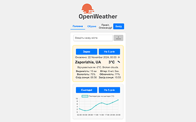

<h1 align="center">Hi 👋, I'm Alexandr Sytnikov</h1>
<h3 align="center">A passionate fullstack developer from ZP</h3>

# My Pet Projects:

| Project Screenshot                                | Project Description                                                                                                                                                                                         |
| ------------------------------------------------- | ----------------------------------------------------------------------------------------------------------------------------------------------------------------------------------------------------------- |
|        | **Cinema Manager** Cinema manager client is a project that implements the ability to store and organize information about movies, actors, directors, and studios.  [GitHub Repo](https://github.com/sytnikovzp/Cinema-manager) |
|              | **Weather** An application for viewing weather forecasts with dynamic updates and geolocation support.  [GitHub Repo](https://github.com/sytnikovzp/weather)                                              |
|  | **Home Accounting** An app for tracking personal finances. Allows monitoring of expenses and income. Currently in development.  [GitHub Repo](https://github.com/sytnikovzp/home-accounting)              |

---

<h3 align="center">Languages and Tools:</h3>

                  

