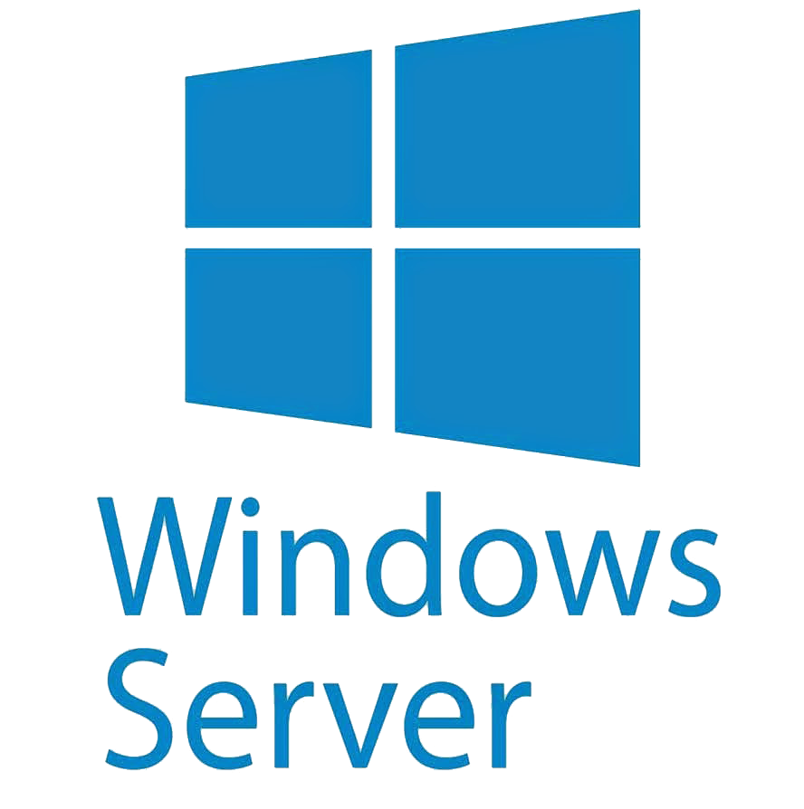

<h1 align="center">Hey there! I'm Oleksandr Sytnikov</h1>
<h3 align="center">Crafting fullstack web apps from the heart of Zaporizhzhia 🇺🇦</h3>

  📄 <a href="./CV/Sytnikov_CV.pdf"><strong>View My Resume (PDF)</strong></a>

  

### 💼 My Portfolio

---

| Project Screenshot                                                                                                                                                                     | Project Description                                                                                                                                                                                                                                                                                                                                                                                                                                                              |
| -------------------------------------------------------------------------------------------------------------------------------------------------------------------------------------- | -------------------------------------------------------------------------------------------------------------------------------------------------------------------------------------------------------------------------------------------------------------------------------------------------------------------------------------------------------------------------------------------------------------------------------------------------------------------------------- |
|                                      | [🆠**Home Accounting**](https://github.com/sytnikovzp/home-accounting#readme)  Web application for home accounting with authorization, adding/editing transactions, filters, and graphs.                                                                                                                                                                          |
|                                                  | [**Weather App**](https://github.com/sytnikovzp/weather-app#readme)  An interactive weather application that allows users to view forecasts for different cities, use geolocation to find local weather, and manage a list of favorite locations.                                                                                                                      |
|                                         | [**Cinema Manager**](https://github.com/sytnikovzp/cinema-manager#readme)  Cinema Manager is a project that implements the ability to store and organize information about films, actors, directors, and studios.                                                                                                                                                   |
|                  | [**ESLint Plugin for Sorting MUI sx Properties**](https://github.com/sytnikovzp/eslint-plugin-mui-sx-order#readme)  This ESLint plugin helps maintain the correct order of properties in MUI (Material-UI) sx objects according to best practices. Published on [npm](https://www.npmjs.com/package/eslint-plugin-mui-sx-order).                        |
|  | [**ESLint Plugin for Require "use client" directive when using client-only React APIs**](https://github.com/sytnikovzp/eslint-plugin-require-use-client#readme)  This ESLint plugin helps Require "use client" directive when using client-only React APIs. Published on [npm](https://www.npmjs.com/package/eslint-plugin-require-use-client).   |

---

### 🌟 My Certificates & Education

---

  
  

---

### 🧑‍💻 My Tech Stack

---

#### 💻 Frontend

  
  
  
  
  
  
  
  
  
  
  
  
  
  

#### 🖥️ Backend

  
  
  
  
  
  
  
  
  
  

#### 🛠️ Dev Tools / Code Quality

  
  
  
  
  
  
  
  

#### 🧪 Testing & API

  
  

#### ⚙️ System Administration

  
  
  
  
  
  
  
  

---

---

© 2023–2025 Designed by Oleksandr Sytnikov

